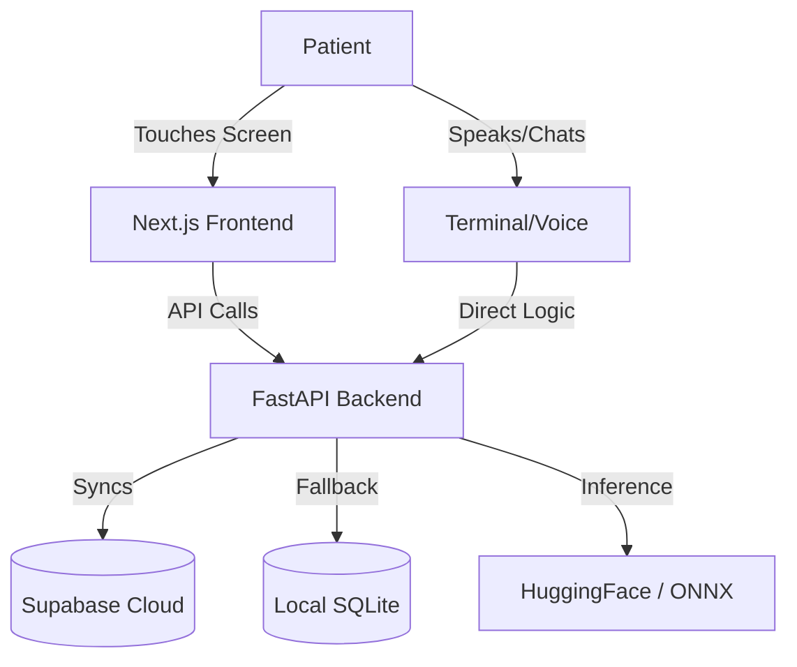

<div align="center">
  
  
  <p align="center">
    <strong>Revolutionizing Healthcare Management with AI, Voice, and Seamless Automation</strong>
  </p>

  <p align="center">
    <a href="https://github.com/snowdencubes/MediVERSE/releases"></a>
    <a href="https://www.python.org/"></a>
    <a href="https://nextjs.org/"></a>
    <a href="https://fastapi.tiangolo.com/"></a>
    <a href="https://supabase.com/"></a>
  </p>
</div>

---

## 🌟 Why MediVERSE? (The Hackathon Hook)
**Imagine a hospital where queues manage themselves and AI triages patients before they even see a doctor.** 

**MediVERSE** is a full-stack, AI-powered hospital management ecosystem. It seamlessly bridges the gap between physical hospital kiosks and advanced digital AI triage. Whether a patient uses the Next.js touch kiosk, chats with our LLM, or speaks directly to our Voice Assistant, MediVERSE handles check-in, dynamic queuing, and digital receipts (with instantly scannable QR codes) in real-time.

### ✨ Key Features That Wow
- 🚀 **Omnichannel Triage:** 
  - **Web UI:** Stunning Kiosk-style interface built on Next.js.
  - **AI Mode:** Understands symptoms in English, Hindi, and Hinglish using Qwen 72B (Online) or Qwen 0.5B-3B (100% Offline ONNX).
  - **Voice Mode:** Always-listening STT (Google/Vosk) + TTS (Edge-TTS).
- ⚡ **Digital Receipts via QR:** Instantly generates PDF receipts uploaded to Supabase Storage. Patients just scan a QR code and walk away.
- 🔋 **Resilient Architecture:** Fallback to local SQLite when offline. Once the internet returns, background threads seamlessly sync to Supabase.
- 🛠️ **Zero Config Launch:** Everything runs from one command: `python main.py`

---

## 🌌 The MediVERSE Superpowers

<blockquote style="border-left: 4px solid #0052cc; background-color: #f6f8fa; padding: 10px 15px; border-radius: 4px;">
  <strong>🔥 Offline First, Cloud Second:</strong> Internet went down? No problem. MediVERSE continues triaging patients locally using SQLite and lightweight ONNX language models. The moment you're back online, background daemons silently sync everything securely to Supabase.
</blockquote>

<blockquote style="border-left: 4px solid #3ECF8E; background-color: #f6f8fa; padding: 10px 15px; border-radius: 4px;">
  <strong>🗣️ Multilingual Voice Triage:</strong> Forget typing. Patients simply speak their symptoms in English, Hindi, or Hinglish. RITMO (our AI agent) listens, understands, and instantly predicts the exact medical department they need.
</blockquote>

<blockquote style="border-left: 4px solid #111; background-color: #f6f8fa; padding: 10px 15px; border-radius: 4px;">
  <strong>📱 Paperless Hospital Queue:</strong> Instantly generated PDF receipts securely dropped into Supabase buckets. Patients scan a quick QR code off the kiosk screen on their mobile device and walk straight to their assigned queue.
</blockquote>

---

## 👨‍💻 Meet the Masterminds

<div align="center">
  <table style="border-collapse: collapse; border: none;">
    <tr>
      <td align="center" style="border: none; padding: 15px;">
        <a href="https://github.com/pheonix14">
          
          <br />
          <b style="font-size: 1.0em;">Phoenix 14</b>
        </a>
        <br />
        <span style="color: #0052cc; font-weight: bold; font-size: 0.85em;">Lead Developer</span><br/>
      </td>
      <td align="center" style="border: none; padding: 15px;">
        <a href="https://github.com/krishkumarcodes">
          
          <br />
          <b style="font-size: 1.0em;">Showden</b>
        </a>
        <br />
        <span style="color: #0052cc; font-weight: bold; font-size: 0.85em;">Second Developer</span><br/>
      </td>
      <td align="center" style="border: none; padding: 15px;">
        <a href="https://github.com/snowdencubes">
          
          <br />
          <b style="font-size: 1.0em;">Snowden</b>
        </a>
        <br />
        <span style="color: #555; font-weight: bold; font-size: 0.85em;">Third Developer</span><br/>
        <i style="font-size: 0.8em;">(Krish Kumar's Alt)</i>
      </td>
      <td align="center" style="border: none; padding: 15px;">
        <a href="https://github.com/droy">
          
          <br />
          <b style="font-size: 1.0em;">Dipankar Roy</b>
        </a>
        <br />
        <span style="color: #555; font-weight: bold; font-size: 0.85em;">Contributor</span><br/>
      </td>
    </tr>
  </table>
</div>

---

## 🛠️ Architecture



---

## 🚀 Getting Started

### 1. Clone & Install
```bash
git clone https://github.com/snowdencubes/MediVERSE.git
cd MediVERSE
pip install fastapi uvicorn supabase requests
```

### 2. Configure (Zero Leaks!)
Copy `config.example.json` to `config.json` and add your keys. **(Don't worry, `config.json` is gitignored so your keys are safe and will never be committed!)**
```jsonc
{
  "supabase": {
    "url": "https://xxxx.supabase.co",
    "key": "eyJ..."
  },
  "hf_token": "hf_..."
}
```

### 3. Launch
```bash
python main.py
```
*Choose between Web UI, Terminal AI, or Backend-only mode!*

---

## 📁 Complete File Structure (Simplified)
```text
MediVERSE/
├── main.py              # Magic entry point
├── rekov/               # FastAPI Backend & System Launcher
├── rekoviu/             # Next.js Frontend
├── base/                # DB Layer & Offline SQLite logic
└── data/                # Local data (Receipts, DBs, Offline Backups)
```

---

<div align="center">
  <b>Built with ❤️ for the future of healthcare.</b><br>
  <sub>MediVERSE v12.0.0 · Hospital AI Queue Management System</sub>
</div>
